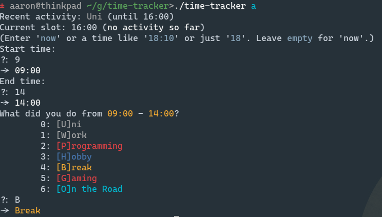

# Time-Tracker

Small time-tracking / productivity for myself by myself.
Records activities in 30min slots and reports on
productivity.

## Features

- configurable activities
- comprehensive statistics
- concise and extremely

## Screenshots




## Usage

Run without any command to get prompted for activity since last
usage.

```
Commands:
	today (t): Print statistics for today.
	day (d): Print statistics for certain day.
	week (w): Print statistics for last seven days.
	year (y): Print statistics for last year.
	split (s): Split the time since the last recorded activity in two.
	edit (e): Edit activities for today in text editor.
	activity (a): Enter an activity for a specific time span.

Current data file: "/home/aaron/.local/share/2021-7-20.json"
Config file: "/home/aaron/.config/ttrc.toml"
```
