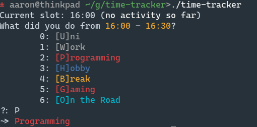
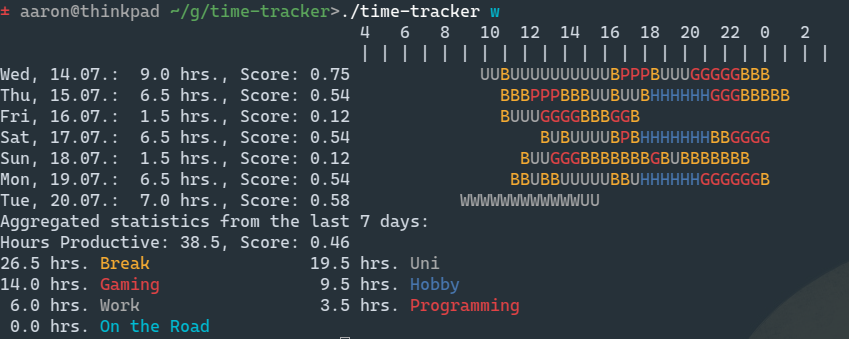

# Time-Tracker

Small time-tracking / productivity tool for myself by myself.
Records activities in 15min[^1] slots and reports on
productivity.

## Features

- configurable activities
- comprehensive statistics
- concise and extremely efficient UI, according to me

## Download

https://github.com/hilbigan/time-tracker/releases

## Screenshots

<div style="text-align:center">


</div>

## Usage

Run without any command to get prompted for activity since last
usage. The first time you run time-tracker, a config file will be created.

```
Commands:
	activity (a): Enter an activity for a specific time span.
	comment (c): Add comment to last activity.
	day (d): Print statistics for a specific day.
	yesterday (yd): Print statistics for yesterday.
	lastday (ld): Print statistics for the last day.
	edit (e): Edit activities for a specific day in text editor.
	edittoday (ed): Edit activities for today in text editor.
	path (p): Print today's data file path.
	split (s): Split the time since the last recorded activity in two (three, ...)
	today (t): Print statistics for today.
	until (u): Like split, but only enter the first activity.
	week (w): Print statistics for last seven days.
	year (y): Print statistics for last year.
	Tip: many commands work with a prefixed count, e.g.: 3s, 3d, 3w, ...

Danger zone:
	clear: Delete today's file.

Current data file: "/home/aaron/.local/share/2025-3-24.json"
Config file: "/home/aaron/.config/ttrc.toml"
Set TT_CONFIG to override config file path.
```

## Build

Build

```
cargo build --release
```

Test

```
cargo test
```

[^1]: Configurable, see `src/main.rs::SLOTS_PER_HOUR`
