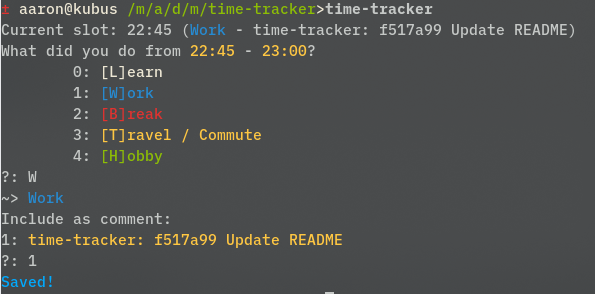

# Time-Tracker

Small time-tracking / productivity tool for myself by myself.
Records activities in 15min[^1] slots and reports on
productivity.

## Features

- configurable activities
- comprehensive statistics
- concise and extremely efficient UI, according to me

## Download

https://github.com/hilbigan/time-tracker/releases

## Screenshots

<div style="text-align:center">


</div>

## Usage

Run without any command to get prompted for activity since last
usage. The first time you run time-tracker, a config file will be created.

```
Commands:
	activity (a): Enter an activity for a specific time span.
	comment (c): Add comment to last activity.
	day (d): Print statistics for a specific day.
	yesterday (yd): Print statistics for yesterday.
	lastday (ld): Print statistics for the last day.
	edit (e): Edit activities for a specific day in text editor.
	edittoday (ed): Edit activities for today in text editor.
	path (p): Print today's data file path.
	split (s): Split the time since the last recorded activity in two (three, ...)
	today (t): Print statistics for today.
	until (u): Like split, but only enter the first activity.
	week (w): Print statistics for last seven days.
	year (y): Print statistics for last year.
	Tip: many commands work with a prefixed count, e.g.: 3s, 3d, 3w, ...

Danger zone:
	clear: Delete today's file.

Current data file: "/home/aaron/.local/share/2025-3-24.json"
Config file: "/home/aaron/.config/ttrc.toml"
Set TT_CONFIG to override config file path.
```

## Example Workflow

It is 23:10, let's start by checking what we've done today, so far:

```
$ time-tracker today
Recent activity: Break (until 20:30)
Current slot: 23:00 (no activity so far)
20:00-20:30 - Break
Hours Productive: 0
```

We had a break from 20:00-20:30 and have not registered any activities since then.
Let's say we want to register "Work" from 20:30-22:00 and "Learn" after that until now.
Running time-tracker with no arguments asks us what we've been doing since 20:30, which is not quite what we want:

```
$ time-tracker
Recent activity: Break (until 20:30)
Current slot: 23:00 (no activity so far)
What did you do from 20:30 - 23:15?
	0: [L]earn
	1: [W]ork
	2: [B]reak
	3: [T]ravel / Commute
	4: [H]obby
?: ^C
```

CTRL+C that, we can enter both activities in one go instead using `split`:

```
$ time-tracker split
Recent activity: Break (until 20:30)
Current slot: 23:00 (no activity so far)
Where to split? (Enter 'now' or a time like '18:10' or just '18'. Leave empty for 'now'.)
 - 20:45
 - 21:00
 - 21:15
 - 21:30
 - 21:45
 - 22:00
 - 22:15
 - 22:30
 - 22:45
 - 23:00
?: 22
What did you do from 20:30 - 22:00?
	0: [L]earn
	1: [W]ork
	2: [B]reak
	3: [T]ravel / Commute
	4: [H]obby
?: W
~> Work
Saved!
What did you do from 22:00 - 23:15?
	0: [L]earn
	1: [W]ork
	2: [B]reak
	3: [T]ravel / Commute
	4: [H]obby
?: L
~> Learn
Include as comment:
1: time-tracker: 3275c38 Update README.md
?:
Saved!
```

Note that time-tracker picked up that we made a `git commit` during the latter time span, but we decline to include that here.
Note you can also use `3s` (`s` = `split`) to record three different activities for the elapsed time.

## Build

Build

```
cargo build --release
```

Test

```
cargo test
```

[^1]: Configurable, see `src/main.rs::SLOTS_PER_HOUR`
